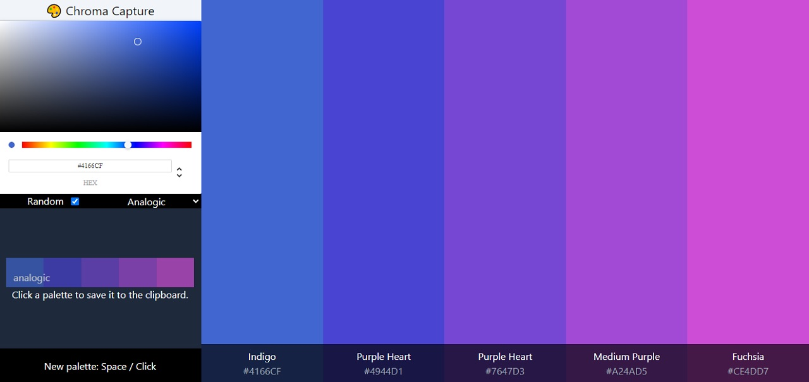

# Chroma Capture

A single page web app color palette generator made with react.  

## Usage

- Press the space bar or click the sidebar footer to generate a new color palette.
- Clicking the footer of a color will save the color's hex code to the clipboard.
- Up to 5 five previous palettes are displayed on the side bar and can be saved to the clipboard in hex format when clicked on.

## Settings

- **Random** is on by default and will generate a palette based on a random hue.
- The **color mode** settings allows for different palettes with "analogic" as the default.

---

Github Pages [Live Demo](https://gaizadzn.github.io/Chroma_capture/)  
built with [The Color Api](https://www.thecolorapi.com).
